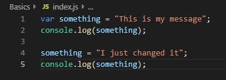
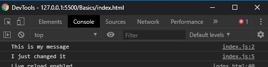

# Denne siden vil vi gå igjennom kort og greit det grunnleggende med Javascript.

#### Gjerne lag en HTML og JS fil og skriv mens du leser forklaringene under.
#### Vi kommer til å bruke en god del ¨console.log()¨ i eksempelene under slik at du kan 
#### visuelt se det på nettsiden din. Om du ikke vet hvordan, trykk over der det står "PGR104-Javascript-Ekstra-Oppgaver" og trykk på
#### **"Hvordan starte VSC Eller Brackets.md.**

### Hvordan lage en variabel:
#### For å lage en variabel i Javascript bruker vi nøkkelordet `var`. Når Javascript leser ordet `var`
#### så vet den at vi skal til å deklarere en variabel. 

Det er to ord innenfor det å lage variabler som går ofte: **¨Deklarere¨** og **¨Definere¨**.

**_Deklarere_**: Er måten vi forteller Javascript at vi har laget en variabel, men som ikke har blitt 
gitt en verdi. F.eks en tekst eller tall verdi.
`var message;` <== Dette er Javascript syntaks for å ¨Deklarere¨ en variabel
Om du kjører eksempelet over i en **console.log()** ==> **Eks: `console.log(message);`**
Så vil du få ut at den sier *`Undefined`*. Dette er fordi den ikke er **_¨Definert¨_**.

**_Definere_**: Når vi definerer en variabel så gir vi den en verdi. Måte dette skrives på er med EN **`=`** 
etter variabel navnet. **Eks: `var message = ;`** og så legger vi til enten en tekst eller tall verdi.
Tekst: `var message = "Hello World!";`
Tall: `var message = 42;`

```
OBS!
En ting som er greit å vite når det gjelder datatypene tekst og tall (string og integer), så er det 
at man kan gjøre litt morsomt med de. Man kan sammeligne tallet `42` med teksten `"42"` og 
Javascript vil si til det er `true` (kommer til dette med `true` og `false` verdier).
```

### Variabler i Javascript kan bytte verdier
`var something = "This is my message";`
Om vi ser på variabelen over så er dette en string/tekst variabel ettersom jeg har skrevet en tekst med "" rundt det. Dette definerer en tekst/string verdi for javascript. Denne verdien tilhører variabel navnet `something` så lenge den ikke blir definert som noe annet.
`something = "I just changed it";` <== Ved å skrive denne koden en linje etter deklarasjonen av variabelen something har vi nå endre hva den inneholder. Om jeg skriver ut den nye verdien i en `console.log()` (Eks: `console.log(something);`) så viser den meg i konsoll-vinduet at verdien er endret.




Du kan fint også bytte variabelens verdi slik at den inneholder et tall istedenfor. Det som er mest ikke bra praktis med dette er at variabel navnet som vi lager burde gi mening for oss som leser koden å vite hva den inneholder. For eksempel så er ikke variabel navnet `something` bra, den er vag og sier ikke hva den inneholder, men om jeg hadde byttet til `message` ville vi visst at den inneholder en tekst ettersom variabel navnet hinter til at det er en melding om noe.

## End
### Gå index.js i samme mappe for å lese mer og se oppgavene lenger ned


