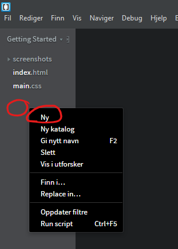
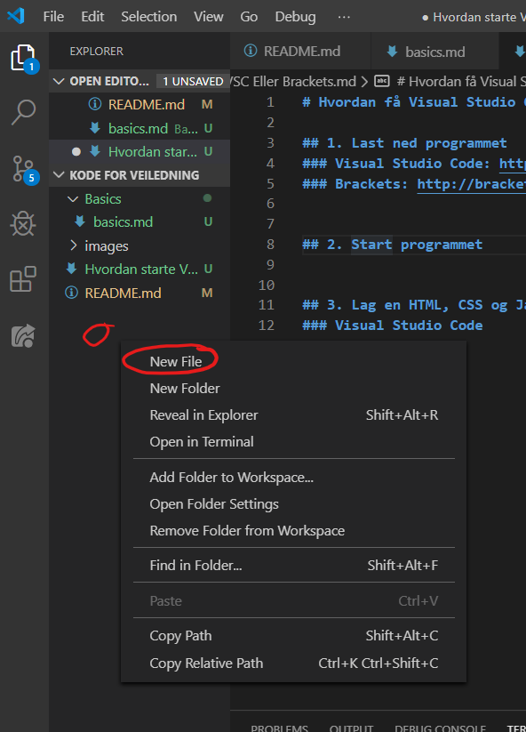
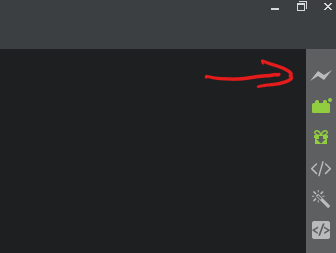
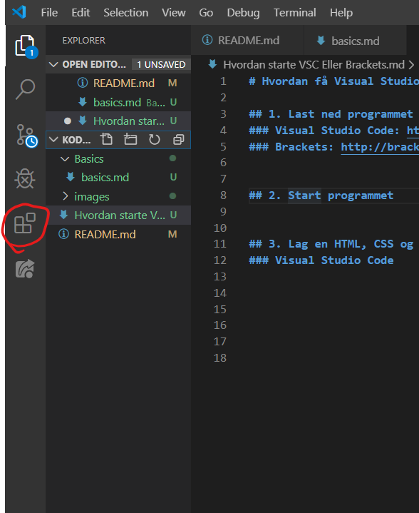
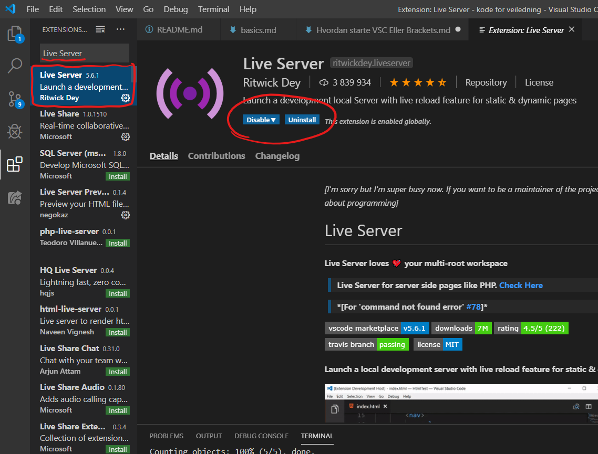
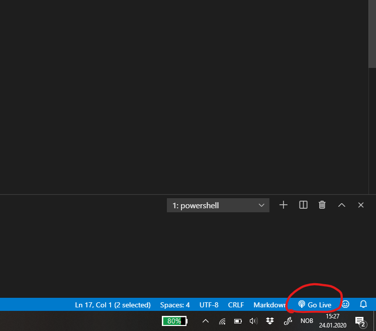
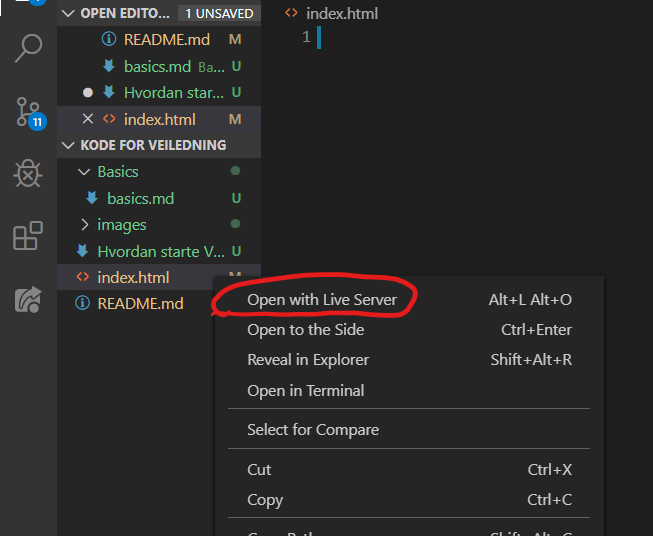
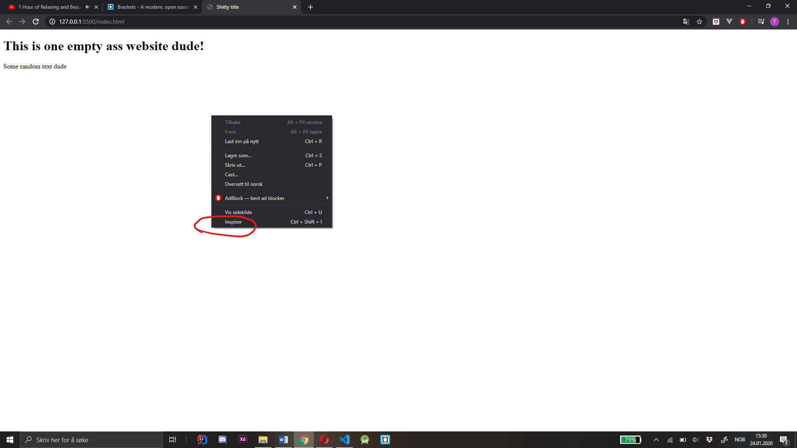
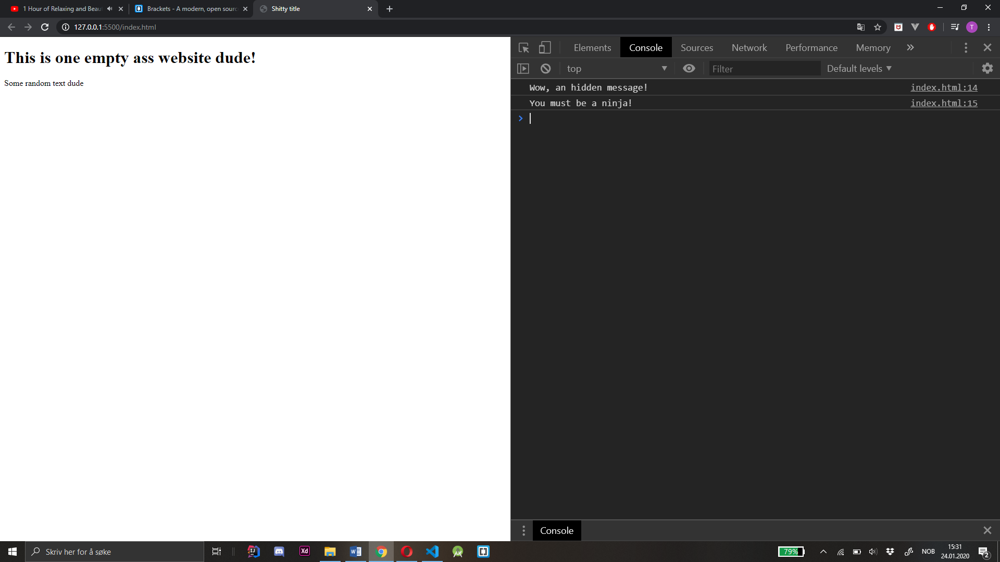

# Hvordan få Visual Studio Code og/eller Brackets til å fungere

## 1. Last ned programmet
### Visual Studio Code: https://code.visualstudio.com/download
### Brackets: http://brackets.io

## 2. Start programmet
### Søk enten i Finder eller i windows delen av din maskin for å finne programmet.

## 3. Lag en HTML, CSS og Javascript fil
### Høyre klikk i vist lokasjon.

### Brackets:

### Visual Studio Code:

## 4. Start live server (Visual Studio Guide må ha extension)
#### Dette vil starte opp din nettside. Sørg for at du har trykket deg inn på filen som avslutter med ¨.html¨
#### og så trykk følgende. Du trenger kun å kjøre en gang, så lenge du lagrer endringene dine ettersom du skriver
#### noe i programmet vil den oppdatere seg automatisk.
#### Shortcuts: Mac = CMD + S. Windows = CTRL + S.

### Brackets: 

### Visual Studio Code: 

### Visual Studio Code: Lukk programmet og start det opp på nytt.
### I Visual Studio Code kan man starte på 2 forskjellige måter:

### 4-1. Trykk inn på html fil og trykk nederst til høyre ¨Go Live¨

### 4-2. Høyre klikk på html filen og trykk ¨Open with Live Server¨

## 5. Åpne konsoll vinduet i nettleseren (mest vanlgist Chrome)

## 6. Nå er du klar til å kode!

